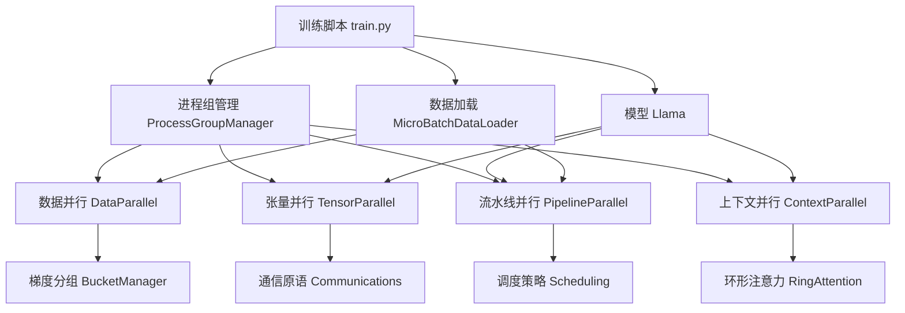

# 项目架构分析

## 1. 引言

Picotron是一个极简的分布式训练框架，专门用于预训练类似Llama的模型。本文将深入分析Picotron项目的整体架构设计、模块组织和代码结构，帮助读者理解其设计思想和实现方式。

## 2. 项目整体架构

### 2.1 设计理念

Picotron遵循以下设计理念：

- **极简主义**：每个核心模块代码控制在300行以内
- **教育导向**：代码清晰易懂，适合学习和实验
- **模块化设计**：各并行技术独立实现，便于组合
- **高性能**：在64个H100 GPU上达到38% MFU

### 2.2 项目结构

```
picotron/
├── picotron/
│   ├── __init__.py
│   ├── model.py                    # Llama模型实现
│   ├── data.py                     # 数据加载和处理
│   ├── checkpoint.py              # 检查点管理
│   ├── utils.py                    # 工具函数
│   ├── process_group_manager.py    # 进程组管理
│   ├── data_parallel/             # 数据并行实现
│   │   ├── __init__.py
│   │   ├── data_parallel.py       # 数据并行核心
│   │   └── bucket.py               # 梯度分组管理
│   ├── tensor_parallel/           # 张量并行实现
│   │   ├── __init__.py
│   │   ├── tensor_parallel.py     # 张量并行核心
│   │   └── tp_communications.py    # 张量并行通信
│   ├── pipeline_parallel/         # 流水线并行实现
│   │   ├── __init__.py
│   │   ├── pipeline_parallel.py   # 流水线并行核心
│   │   └── pp_communications.py    # 流水线并行通信
│   └── context_parallel/          # 上下文并行实现
│       ├── __init__.py
│       ├── context_parallel.py    # 上下文并行核心
│       └── cp_communications.py    # 上下文并行通信
├── train.py                       # 训练脚本
├── create_config.py               # 配置生成
├── submit_slurm_jobs.py           # SLURM作业提交
├── extract_metrics.py             # 指标提取
├── setup.py                       # 安装脚本
├── requirements.txt               # 依赖包
└── tests/                         # 测试代码
    ├── test_dataloader.py
    └── test_tensor_parallel.py
```

### 2.3 核心组件关系



## 3. 进程组管理架构

### 3.1 ProcessGroupManager设计

```python
# picotron/process_group_manager.py
class ProcessGroupManager:
    """管理4D并行的进程组"""
    
    def __init__(self, tp_size, cp_size, pp_size, dp_size):
        self.tp_size = tp_size      # 张量并行大小
        self.cp_size = cp_size      # 上下文并行大小
        self.pp_size = pp_size      # 流水线并行大小
        self.dp_size = dp_size      # 数据并行大小
        
        # 计算世界大小和排名
        self.world_size = tp_size * cp_size * pp_size * dp_size
        self.setup_process_groups()
    
    def setup_process_groups(self):
        """设置4D并行的进程组"""
        # 创建各维度的进程组
        self.tp_group = self.create_tensor_parallel_group()
        self.cp_group = self.create_context_parallel_group()
        self.pp_group = self.create_pipeline_parallel_group()
        self.dp_group = self.create_data_parallel_group()
        
        # 组合进程组
        self.cp_dp_group = self.create_cp_dp_group()
```

### 3.2 进程组创建逻辑

```python
def create_tensor_parallel_group(self):
    """创建张量并行进程组"""
    tp_ranks = []
    for i in range(self.tp_size):
        group_ranks = []
        for j in range(self.dp_size):
            for k in range(self.pp_size):
                for l in range(self.cp_size):
                    rank = i + j * self.tp_size * self.pp_size * self.cp_size + \
                           k * self.tp_size * self.cp_size + l * self.tp_size
                    group_ranks.append(rank)
        tp_ranks.append(group_ranks)
    
    return [dist.new_group(ranks=ranks) for ranks in tp_ranks]

def create_context_parallel_group(self):
    """创建上下文并行进程组"""
    cp_ranks = []
    for i in range(self.tp_size):
        for j in range(self.dp_size):
            for k in range(self.pp_size):
                group_ranks = []
                for l in range(self.cp_size):
                    rank = i + j * self.tp_size * self.pp_size * self.cp_size + \
                           k * self.tp_size * self.cp_size + l * self.tp_size
                    group_ranks.append(rank)
                cp_ranks.append(group_ranks)
    
    return [dist.new_group(ranks=ranks) for ranks in cp_ranks]
```

### 3.3 进程组访问接口

```python
# 便捷的访问接口
@property
def tp_world_size(self):
    """张量并行世界大小"""
    return self.tp_size

@property
def tp_rank(self):
    """张量并行排名"""
    return self.global_rank % self.tp_size

@property
def cp_world_size(self):
    """上下文并行世界大小"""
    return self.cp_size

@property
def cp_rank(self):
    """上下文并行排名"""
    return (self.global_rank // self.tp_size) % self.cp_size

@property
def pp_world_size(self):
    """流水线并行世界大小"""
    return self.pp_size

@property
def pp_rank(self):
    """流水线并行排名"""
    return (self.global_rank // (self.tp_size * self.cp_size)) % self.pp_size

@property
def dp_world_size(self):
    """数据并行世界大小"""
    return self.dp_size

@property
def dp_rank(self):
    """数据并行排名"""
    return self.global_rank // (self.tp_size * self.cp_size * self.pp_size)

@property
def pp_is_first_stage(self):
    """是否是流水线第一阶段"""
    return self.pp_rank == 0

@property
def pp_is_last_stage(self):
    """是否是流水线最后阶段"""
    return self.pp_rank == self.pp_world_size - 1
```

## 4. 模型架构设计

### 4.1 Llama模型整体结构

```python
# picotron/model.py
class Llama(nn.Module):
    def __init__(self, config):
        super().__init__()
        
        # 基础参数
        self.vocab_size = config.vocab_size
        self.hidden_size = config.hidden_size
        self.num_heads = config.num_attention_heads
        self.num_key_values = config.num_key_value_heads
        self.head_dim = self.hidden_size // self.num_heads
        self.max_position_embeddings = config.max_position_embeddings
        self.num_layers = config.num_hidden_layers
        
        # 核心组件
        self.embedding = Embedding(self.vocab_size, self.hidden_size)
        self.decoder_layers = nn.ModuleList([
            DecoderLayer(config, layer_idx=i) for i in range(self.num_layers)
        ])
        self.final_proj = FinalProjection(self.hidden_size, self.vocab_size)
        self.final_norm = LlamaRMSNorm(self.hidden_size, eps=config.rms_norm_eps)
```

### 4.2 DecoderLayer设计

```python
class DecoderLayer(nn.Module):
    def __init__(self, config, layer_idx):
        super().__init__()
        
        # 标准化层
        self.input_layernorm = LlamaRMSNorm(config.hidden_size, eps=config.rms_norm_eps)
        self.post_attention_layernorm = LlamaRMSNorm(config.hidden_size, eps=config.rms_norm_eps)
        
        # 注意力层
        self.attention = Attention(config, layer_idx=layer_idx)
        
        # MLP层
        self.mlp = MLP(config)
        
        # 位置编码
        head_dim = config.hidden_size // config.num_attention_heads
        self.cos, self.sin = get_cos_sin(
            config.max_position_embeddings, 
            head_dim=head_dim, 
            base=config.rope_theta
        )
        
        # 上下文并行适配
        self.cos, self.sin = context_parallel.update_rope_for_context_parallel(self.cos, self.sin)
```

### 4.3 Attention层设计

```python
class Attention(nn.Module):
    def __init__(self, config, layer_idx):
        super().__init__()
        
        # 投影层
        self.q_proj = nn.Linear(config.hidden_size, self.num_heads * self.head_dim, bias=False)
        self.k_proj = nn.Linear(config.hidden_size, self.num_key_values * self.head_dim, bias=False)
        self.v_proj = nn.Linear(config.hidden_size, self.num_key_values * self.head_dim, bias=False)
        self.out_proj = nn.Linear(config.hidden_size, config.hidden_size, bias=False)
        
        # 张量并行适配
        self.num_local_heads = config.num_attention_heads // pgm.process_group_manager.tp_world_size
        self.num_local_kv_heads = config.num_key_value_heads // pgm.process_group_manager.tp_world_size
```

## 5. 数据加载架构

### 5.1 MicroBatchDataLoader设计

```python
# picotron/data.py
class MicroBatchDataLoader:
    def __init__(self, micro_batch_size, seq_length, dataset_name, tokenizer_name,
                 grad_acc_steps, device, num_workers=0, num_proc=1, 
                 num_samples=None, subset_name=None, split="train"):
        
        self.micro_batch_size = micro_batch_size
        self.seq_length = seq_length
        self.grad_acc_steps = grad_acc_steps
        self.device = device
        
        # 计算全局batch size
        self.global_batch_size = micro_batch_size * grad_acc_steps * pgm.process_group_manager.dp_world_size
        
        # 初始化数据集和分词器
        self.tokenizer = AutoTokenizer.from_pretrained(tokenizer_name)
        self.dataset = self.load_dataset(dataset_name, subset_name, split, num_samples)
        
        # 创建数据迭代器
        self.iterator = self.create_iterator(num_workers, num_proc)
```

### 5.2 数据处理流程

```python
def create_iterator(self, num_workers, num_proc):
    """创建数据迭代器"""
    def data_generator():
        # 数据预处理
        processed_dataset = self.dataset.map(
            self.tokenize_function,
            batched=True,
            num_proc=num_proc,
            remove_columns=self.dataset.column_names
        )
        
        # 分组处理
        processed_dataset = processed_dataset.map(
            self.group_texts,
            batched=True,
            num_proc=num_proc
        )
        
        # 创建数据加载器
        dataloader = torch.utils.data.DataLoader(
            processed_dataset,
            batch_size=self.micro_batch_size,
            shuffle=True,
            num_workers=num_workers,
            drop_last=True
        )
        
        # 无限循环
        while True:
            for batch in dataloader:
                yield {
                    "input_ids": batch["input_ids"],
                    "target_ids": batch["labels"],
                    "position_ids": batch.get("position_ids", None)
                }
    
    return data_generator()

def __next__(self):
    """获取下一个批次"""
    return next(self.iterator)
```

## 6. 训练流程架构

### 6.1 训练脚本整体流程

```python
# train.py
def main():
    # 1. 环境初始化
    setup_environment()
    
    # 2. 分布式初始化
    setup_distributed()
    
    # 3. 进程组管理
    setup_process_group_manager()
    
    # 4. 数据加载
    data_loader = MicroBatchDataLoader(...)
    
    # 5. 模型初始化
    model = initialize_model()
    
    # 6. 并行包装
    model = apply_parallel_strategies(model)
    
    # 7. 优化器设置
    optimizer = setup_optimizer(model)
    
    # 8. 训练循环
    training_loop(model, data_loader, optimizer)
```

### 6.2 并行策略应用

```python
def apply_parallel_strategies(model):
    """应用并行策略"""
    model_config = get_model_config()
    
    # 1. 张量并行
    if pgm.process_group_manager.tp_world_size > 1:
        model = apply_tensor_parallel(model)
    
    # 2. 流水线并行
    if pgm.process_group_manager.pp_world_size > 1:
        model = PipelineParallel(model, model_config)
    
    # 3. 上下文并行
    if pgm.process_group_manager.cp_world_size > 1:
        model = apply_context_parallel(model)
    
    # 4. 数据并行
    if pgm.process_group_manager.dp_world_size > 1:
        model = DataParallelBucket(model)
    
    return model
```

### 6.3 训练步骤选择

```python
def training_step(model, data_loader, optimizer):
    """执行训练步骤"""
    optimizer.zero_grad()
    
    # 根据并行配置选择训练步骤
    if pgm.process_group_manager.pp_world_size > 1:
        if config["distributed"]["pp_engine"] == "afab":
            loss = train_step_pipeline_afab(model, data_loader, tensor_shapes, device, dtype)
        elif config["distributed"]["pp_engine"] == "1f1b":
            loss = train_step_pipeline_1f1b(model, data_loader, tensor_shapes, device, dtype)
        else:
            raise ValueError(f"Invalid pipeline parallel engine: {config['distributed']['pp_engine']}")
    else:
        loss = train_step(model, data_loader, device)
    
    # 梯度平均和优化器步骤
    loss = average_loss_across_dp_cp_ranks(loss, device)
    optimizer.step()
    
    return loss
```

## 7. 通信架构设计

### 7.1 通信原语抽象

```python
# 通信原语基类
class CommunicationPrimitive:
    def __init__(self, group):
        self.group = group
    
    def all_reduce(self, tensor, op=dist.ReduceOp.SUM):
        """All-Reduce操作"""
        dist.all_reduce(tensor, op=op, group=self.group)
        return tensor
    
    def all_gather(self, tensor):
        """All-Gather操作"""
        output_list = [torch.empty_like(tensor) for _ in range(dist.get_world_size(group=self.group))]
        dist.all_gather(output_list, tensor, group=self.group)
        return torch.cat(output_list, dim=0)
    
    def broadcast(self, tensor, src):
        """Broadcast操作"""
        dist.broadcast(tensor, src=src, group=self.group)
        return tensor
```

### 7.2 自动微分函数

```python
# 张量并行通信函数
class ReduceFromModelParallelRegion(torch.autograd.Function):
    @staticmethod
    def forward(ctx, input_):
        return input_
    
    @staticmethod
    def backward(ctx, grad_output):
        # 反向传播时进行All-Reduce
        dist.all_reduce(grad_output, op=dist.ReduceOp.SUM, group=pgm.process_group_manager.tp_group)
        return grad_output

class GatherFromModelParallelRegion(torch.autograd.Function):
    @staticmethod
    def forward(ctx, input_):
        # 前向传播时进行Gather
        output_list = [torch.empty_like(input_) for _ in range(pgm.process_group_manager.tp_world_size)]
        dist.all_gather(output_list, input_, group=pgm.process_group_manager.tp_group)
        output = torch.cat(output_list, dim=-1)
        return output
    
    @staticmethod
    def backward(ctx, grad_output):
        # 反向传播时进行Split
        rank = pgm.process_group_manager.tp_rank
        chunk_size = grad_output.size(-1) // pgm.process_group_manager.tp_world_size
        grad_input = grad_output[..., rank*chunk_size:(rank+1)*chunk_size]
        return grad_input
```

### 7.3 异步通信管理

```python
class AsyncCommunicationManager:
    def __init__(self):
        self.requests = []
    
    def isend(self, tensor, dst, group):
        """异步发送"""
        req = dist.isend(tensor, dst=dst, group=group)
        self.requests.append(req)
        return req
    
    def irecv(self, tensor, src, group):
        """异步接收"""
        req = dist.irecv(tensor, src=src, group=group)
        self.requests.append(req)
        return req
    
    def wait_all(self):
        """等待所有异步操作完成"""
        for req in self.requests:
            req.wait()
        self.requests.clear()
```

## 8. 配置管理架构

### 8.1 配置生成

```python
# create_config.py
def create_config(args):
    """创建训练配置"""
    config = {
        "model": {
            "name": args.model_name,
            "use_fused_adam": True,
            "num_hidden_layers": args.num_hidden_layers,
            "num_attention_heads": args.num_attention_heads,
            "num_key_value_heads": args.num_key_value_heads,
        },
        "distributed": {
            "tp_size": args.tp,
            "pp_size": args.pp,
            "dp_size": args.dp,
            "cp_size": args.cp,
            "pp_engine": args.pp_engine,
            "use_cpu": args.use_cpu,
        },
        "training": {
            "micro_batch_size": args.mbs,
            "gradient_accumulation_steps": args.grad_acc_steps,
            "seq_length": args.seq_len,
            "learning_rate": args.learning_rate,
            "max_tokens": args.max_tokens,
            "total_train_steps": args.total_train_steps,
        },
        "dataset": {
            "name": args.dataset_name,
            "num_workers": args.num_workers,
            "num_proc": args.num_proc,
            "subset_name": args.subset_name,
            "split": args.split,
        },
        "checkpoint": {
            "save_frequency": args.save_frequency,
            "save_dir": args.save_dir,
            "load_path": args.load_path,
        },
        "logging": {
            "use_wandb": args.use_wandb,
            "run_name": args.exp_name,
        },
        "environment": {
            "OMP_NUM_THREADS": args.omp_num_threads,
            "TOKENIZERS_PARALLELISM": args.tokenizers_parallelism,
            "FLASH_ATTEN": args.flash_aten,
            "HF_TOKEN": args.hf_token,
        }
    }
    
    return config
```

### 8.2 配置验证

```python
def validate_config(config):
    """验证配置参数"""
    # 检查并行配置
    world_size = int(os.environ["WORLD_SIZE"])
    expected_world_size = (config["distributed"]["tp_size"] * 
                         config["distributed"]["pp_size"] * 
                         config["distributed"]["dp_size"] * 
                         config["distributed"]["cp_size"])
    
    assert world_size == expected_world_size, f"World size mismatch: expected {expected_world_size}, got {world_size}"
    
    # 检查序列长度和上下文并行
    seq_length = config["training"]["seq_length"]
    cp_size = config["distributed"]["cp_size"]
    assert seq_length % cp_size == 0, f"Sequence length must be divisible by context parallel size"
    
    # 检查模型配置
    assert config["model"]["num_attention_heads"] % config["distributed"]["tp_size"] == 0, \
        "Number of attention heads must be divisible by tensor parallel size"
```

## 9. 测试架构

### 9.1 单元测试

```python
# tests/test_tensor_parallel.py
import unittest
import torch
import torch.nn as nn
from picotron.tensor_parallel import apply_tensor_parallel, ColumnParallelLinear, RowParallelLinear

class TestTensorParallel(unittest.TestCase):
    def setUp(self):
        self.hidden_size = 512
        self.batch_size = 4
        self.seq_length = 128
    
    def test_column_parallel_linear(self):
        """测试列并行线性层"""
        in_features = self.hidden_size
        out_features = self.hidden_size * 2
        
        # 创建列并行线性层
        layer = ColumnParallelLinear(in_features, out_features, bias=False)
        
        # 测试前向传播
        x = torch.randn(self.batch_size, self.seq_length, in_features)
        output = layer(x)
        
        # 检查输出维度
        expected_output_size = out_features // 2  # 假设2路张量并行
        self.assertEqual(output.shape[-1], expected_output_size)
    
    def test_row_parallel_linear(self):
        """测试行并行线性层"""
        in_features = self.hidden_size * 2
        out_features = self.hidden_size
        
        # 创建行并行线性层
        layer = RowParallelLinear(in_features, out_features, bias=False)
        
        # 测试前向传播
        x = torch.randn(self.batch_size, self.seq_length, in_features // 2)  # 假设2路张量并行
        output = layer(x)
        
        # 检查输出维度
        self.assertEqual(output.shape[-1], out_features)
```

### 9.2 集成测试

```python
# tests/test_integration.py
class TestIntegration(unittest.TestCase):
    def test_4d_parallel_integration(self):
        """测试4D并行集成"""
        # 配置参数
        config = {
            "tp_size": 2,
            "pp_size": 2,
            "dp_size": 2,
            "cp_size": 2,
        }
        
        # 初始化分布式环境
        setup_distributed_environment(config)
        
        # 创建模型
        model = create_test_model()
        
        # 应用4D并行
        model = apply_4d_parallel(model, config)
        
        # 测试训练步骤
        loss = test_training_step(model)
        
        # 验证结果
        self.assertIsNotNone(loss)
        self.assertGreater(loss, 0)
```

## 10. 部署架构

### 10.1 SLURM部署

```python
# submit_slurm_jobs.py
def submit_slurm_jobs(config_path, qos="normal", hf_token=None):
    """提交SLURM作业"""
    with open(config_path, 'r') as f:
        config = json.load(f)
    
    # 计算节点数量
    world_size = (config["distributed"]["tp_size"] * 
                 config["distributed"]["pp_size"] * 
                 config["distributed"]["dp_size"] * 
                 config["distributed"]["cp_size"])
    
    nodes = (world_size + 7) // 8  # 假设每节点8个GPU
    
    # 生成SLURM脚本
    slurm_script = generate_slurm_script(config, nodes, qos, hf_token)
    
    # 提交作业
    subprocess.run(["sbatch", slurm_script])
```

### 10.2 本地部署

```python
def local_training_command(config_path):
    """生成本地训练命令"""
    return f"""
    torchrun --nproc_per_node {world_size} train.py --config {config_path}
    """
```

## 11. 总结

Picotron的项目架构体现了以下设计特点：

1. **模块化设计**：各并行技术独立实现，便于理解和组合
2. **清晰的层次结构**：从底层通信到高层训练流程，层次分明
3. **教育导向**：代码简洁，注释详细，适合学习
4. **实用性强**：支持实际的大规模训练需求
5. **可扩展性**：易于添加新的并行技术和优化策略

通过深入理解Picotron的架构设计，可以为设计和实现分布式训练系统提供宝贵的参考和指导。其简洁而强大的设计理念，使得复杂的分布式训练技术变得易于理解和应用。