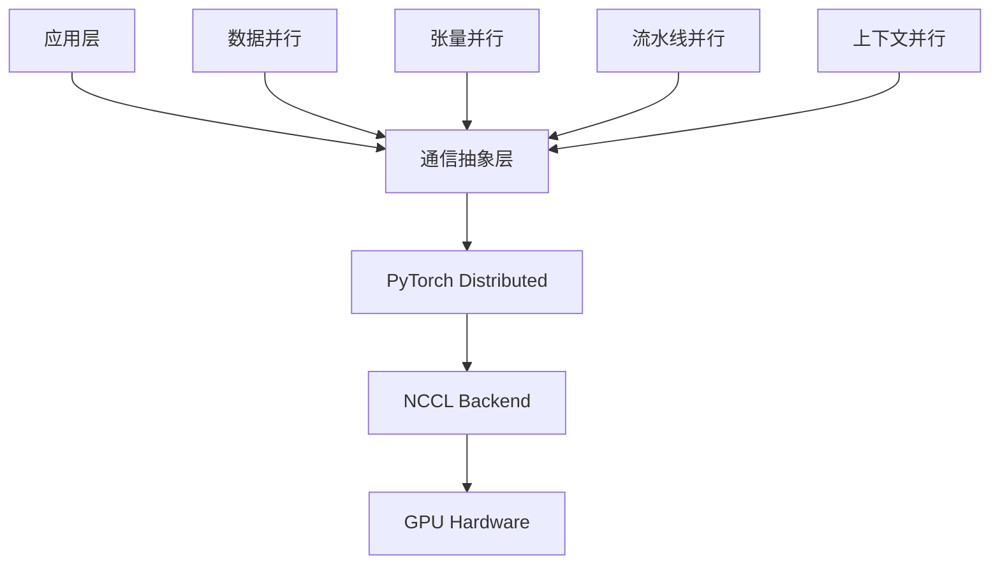

# 通信机制分析

## 1. 引言

Picotron的通信机制是其分布式训练框架的核心组件之一，负责协调多个GPU之间的数据交换和同步。本文将深入分析Picotron的通信机制设计、实现原理和优化策略。

## 2. 通信机制整体架构

### 2.1 通信组件架构

```python
# 通信组件关系图
class CommunicationArchitecture:
    """通信架构"""
    def __init__(self):
        self.process_group_manager = ProcessGroupManager()
        self.communication_primitives = CommunicationPrimitives()
        self.async_communication = AsyncCommunication()
        self.communication_optimization = CommunicationOptimization()
    
    def setup_communication(self, config):
        """设置通信"""
        # 1. 初始化进程组
        self.process_group_manager.setup_process_groups()
        
        # 2. 初始化通信原语
        self.communication_primitives.setup_primitives()
        
        # 3. 设置异步通信
        self.async_communication.setup_async_comm()
        
        # 4. 应用通信优化
        self.communication_optimization.apply_optimizations()
```

### 2.2 通信层次结构



## 3. 进程组管理

### 3.1 ProcessGroupManager设计

```python
# picotron/process_group_manager.py
class ProcessGroupManager:
    """进程组管理器"""
    def __init__(self, tp_size, cp_size, pp_size, dp_size):
        # 并行维度配置
        self.tp_size = tp_size      # 张量并行大小
        self.cp_size = cp_size      # 上下文并行大小
        self.pp_size = pp_size      # 流水线并行大小
        self.dp_size = dp_size      # 数据并行大小
        
        # 计算世界大小和排名
        self.world_size = tp_size * cp_size * pp_size * dp_size
        self.global_rank = int(os.environ.get("RANK", 0))
        self.local_rank = int(os.environ.get("LOCAL_RANK", 0))
        
        # 初始化进程组
        self.setup_process_groups()
    
    def setup_process_groups(self):
        """设置4D并行的进程组"""
        # 创建各维度的进程组
        self.tp_group = self.create_tensor_parallel_group()
        self.cp_group = self.create_context_parallel_group()
        self.pp_group = self.create_pipeline_parallel_group()
        self.dp_group = self.create_data_parallel_group()
        
        # 创建组合进程组
        self.cp_dp_group = self.create_cp_dp_group()
        self.tp_pp_group = self.create_tp_pp_group()
        
        # 验证进程组
        self.validate_process_groups()
    
    def create_tensor_parallel_group(self):
        """创建张量并行进程组"""
        tp_ranks = []
        for i in range(self.tp_size):
            group_ranks = []
            for j in range(self.dp_size):
                for k in range(self.pp_size):
                    for l in range(self.cp_size):
                        rank = i + j * self.tp_size * self.pp_size * self.cp_size + \
                               k * self.tp_size * self.cp_size + l * self.tp_size
                        group_ranks.append(rank)
            tp_ranks.append(group_ranks)
        
        return [dist.new_group(ranks=ranks) for ranks in tp_ranks]
    
    def create_context_parallel_group(self):
        """创建上下文并行进程组"""
        cp_ranks = []
        for i in range(self.tp_size):
            for j in range(self.dp_size):
                for k in range(self.pp_size):
                    group_ranks = []
                    for l in range(self.cp_size):
                        rank = i + j * self.tp_size * self.pp_size * self.cp_size + \
                               k * self.tp_size * self.cp_size + l * self.tp_size
                        group_ranks.append(rank)
                    cp_ranks.append(group_ranks)
        
        return [dist.new_group(ranks=ranks) for ranks in cp_ranks]
    
    def create_pipeline_parallel_group(self):
        """创建流水线并行进程组"""
        pp_ranks = []
        for i in range(self.tp_size):
            for j in range(self.dp_size):
                for k in range(self.pp_size):
                    group_ranks = []
                    for l in range(self.cp_size):
                        rank = i + j * self.tp_size * self.pp_size * self.cp_size + \
                               k * self.tp_size * self.cp_size + l * self.tp_size
                        group_ranks.append(rank)
                    pp_ranks.append(group_ranks)
        
        return [dist.new_group(ranks=ranks) for ranks in pp_ranks]
    
    def create_data_parallel_group(self):
        """创建数据并行进程组"""
        dp_ranks = []
        for i in range(self.dp_size):
            group_ranks = []
            for j in range(self.tp_size):
                for k in range(self.pp_size):
                    for l in range(self.cp_size):
                        rank = j + i * self.tp_size * self.pp_size * self.cp_size + \
                               k * self.tp_size * self.cp_size + l * self.tp_size
                        group_ranks.append(rank)
            dp_ranks.append(group_ranks)
        
        return [dist.new_group(ranks=ranks) for ranks in dp_ranks]
```

### 3.2 进程组访问接口

```python
class ProcessGroupManager:
    """进程组管理器（续）"""
    
    # 张量并行接口
    @property
    def tp_world_size(self):
        """张量并行世界大小"""
        return self.tp_size
    
    @property
    def tp_rank(self):
        """张量并行排名"""
        return self.global_rank % self.tp_size
    
    @property
    def tp_group(self):
        """张量并行组"""
        return self._tp_groups[self.tp_rank]
    
    # 上下文并行接口
    @property
    def cp_world_size(self):
        """上下文并行世界大小"""
        return self.cp_size
    
    @property
    def cp_rank(self):
        """上下文并行排名"""
        return (self.global_rank // self.tp_size) % self.cp_size
    
    @property
    def cp_group(self):
        """上下文并行组"""
        return self._cp_groups[self.tp_rank * self.dp_size + self.dp_rank]
    
    # 流水线并行接口
    @property
    def pp_world_size(self):
        """流水线并行世界大小"""
        return self.pp_size
    
    @property
    def pp_rank(self):
        """流水线并行排名"""
        return (self.global_rank // (self.tp_size * self.cp_size)) % self.pp_size
    
    @property
    def pp_group(self):
        """流水线并行组"""
        return self._pp_groups[self.tp_rank * self.dp_size + self.dp_rank]
    
    # 数据并行接口
    @property
    def dp_world_size(self):
        """数据并行世界大小"""
        return self.dp_size
    
    @property
    def dp_rank(self):
        """数据并行排名"""
        return self.global_rank // (self.tp_size * self.cp_size * self.pp_size)
    
    @property
    def dp_group(self):
        """数据并行组"""
        return self._dp_groups[self.dp_rank]
    
    # 特殊属性
    @property
    def pp_is_first_stage(self):
        """是否是流水线第一阶段"""
        return self.pp_rank == 0
    
    @property
    def pp_is_last_stage(self):
        """是否是流水线最后阶段"""
        return self.pp_rank == self.pp_world_size - 1
    
    @property
    def cp_dp_group(self):
        """上下文并行+数据并行组"""
        return self._cp_dp_groups[self.tp_rank]
    
    def validate_process_groups(self):
        """验证进程组设置"""
        # 检查世界大小
        assert self.world_size == dist.get_world_size(), \
            f"World size mismatch: expected {self.world_size}, got {dist.get_world_size()}"
        
        # 检查各维度进程组
        assert len(self._tp_groups) == self.tp_size
        assert len(self._cp_groups) == self.tp_size * self.dp_size
        assert len(self._pp_groups) == self.tp_size * self.dp_size
        assert len(self._dp_groups) == self.dp_size
        
        print("Process groups validation passed!")
```

## 4. 通信原语设计

### 4.1 基础通信原语

```python
class CommunicationPrimitives:
    """通信原语"""
    def __init__(self, process_group_manager):
        self.pgm = process_group_manager
        
    def all_reduce(self, tensor, group, op=dist.ReduceOp.SUM):
        """All-Reduce操作"""
        dist.all_reduce(tensor, op=op, group=group)
        return tensor
    
    def all_gather(self, tensor, group):
        """All-Gather操作"""
        output_list = [torch.empty_like(tensor) for _ in range(dist.get_world_size(group=group))]
        dist.all_gather(output_list, tensor, group=group)
        return torch.cat(output_list, dim=0)
    
    def reduce_scatter(self, tensor_list, group, op=dist.ReduceOp.SUM):
        """Reduce-Scatter操作"""
        output = torch.empty_like(tensor_list[0])
        dist.reduce_scatter(output, tensor_list, op=op, group=group)
        return output
    
    def broadcast(self, tensor, src, group):
        """Broadcast操作"""
        dist.broadcast(tensor, src=src, group=group)
        return tensor
    
    def send(self, tensor, dst, group):
        """Send操作"""
        dist.send(tensor, dst=dst, group=group)
    
    def recv(self, tensor, src, group):
        """Recv操作"""
        dist.recv(tensor, src=src, group=group)
        return tensor
    
    def barrier(self, group):
        """Barrier操作"""
        dist.barrier(group=group)
```

### 4.2 异步通信原语

```python
class AsyncCommunicationPrimitives(CommunicationPrimitives):
    """异步通信原语"""
    def __init__(self, process_group_manager):
        super().__init__(process_group_manager)
        self.active_requests = []
        self.request_pool = CommunicationRequestPool()
    
    def isend(self, tensor, dst, group):
        """异步发送"""
        req = dist.isend(tensor, dst=dst, group=group)
        self.active_requests.append(req)
        return req
    
    def irecv(self, tensor, src, group):
        """异步接收"""
        req = dist.irecv(tensor, src=src, group=group)
        self.active_requests.append(req)
        return req
    
    def iall_reduce(self, tensor, group, op=dist.ReduceOp.SUM):
        """异步All-Reduce"""
        req = dist.iall_reduce(tensor, op=op, group=group)
        self.active_requests.append(req)
        return req
    
    def wait_all(self):
        """等待所有异步操作完成"""
        for req in self.active_requests:
            req.wait()
        self.active_requests.clear()
    
    def wait_any(self):
        """等待任意异步操作完成"""
        if not self.active_requests:
            return None
        
        completed_req = dist.wait(self.active_requests)
        self.active_requests.remove(completed_req)
        return completed_req
    
    def test_all(self):
        """测试所有异步操作是否完成"""
        return all(req.is_completed() for req in self.active_requests)
    
    def get_pending_requests(self):
        """获取待处理的请求"""
        return len(self.active_requests)
```

### 4.3 集体通信优化

```python
class OptimizedCollectiveCommunication(CommunicationPrimitives):
    """优化的集体通信"""
    def __init__(self, process_group_manager):
        super().__init__(process_group_manager)
        self.communication_optimizer = CommunicationOptimizer()
        
    def optimized_all_reduce(self, tensor, group, op=dist.ReduceOp.SUM):
        """优化的All-Reduce"""
        # 根据张量大小选择优化策略
        if tensor.numel() < 1024:
            # 小张量使用默认All-Reduce
            return self.all_reduce(tensor, group, op)
        else:
            # 大张量使用分块All-Reduce
            return self.chunked_all_reduce(tensor, group, op)
    
    def chunked_all_reduce(self, tensor, group, op=dist.ReduceOp.SUM, chunk_size=1024*1024):
        """分块All-Reduce"""
        if tensor.numel() <= chunk_size:
            return self.all_reduce(tensor, group, op)
        
        # 分块处理
        chunks = tensor.split(chunk_size)
        results = []
        
        for chunk in chunks:
            result = self.all_reduce(chunk.clone(), group, op)
            results.append(result)
        
        return torch.cat(results, dim=0)
    
    def hierarchical_all_reduce(self, tensor, group, op=dist.ReduceOp.SUM):
        """分层All-Reduce"""
        # 获取进程组信息
        world_size = dist.get_world_size(group=group)
        rank = dist.get_rank(group=group)
        
        if world_size <= 8:
            # 小规模使用直接All-Reduce
            return self.all_reduce(tensor, group, op)
        
        # 分层处理
        sub_group_size = 8
        num_sub_groups = world_size // sub_group_size
        
        # 子组内All-Reduce
        sub_group_rank = rank // sub_group_size
        sub_group = self.create_sub_group(group, sub_group_rank, sub_group_size)
        
        # 第一阶段：子组内All-Reduce
        result = self.all_reduce(tensor.clone(), sub_group, op)
        
        # 第二阶段：子组间All-Reduce
        if num_sub_groups > 1:
            inter_group_ranks = [i * sub_group_size for i in range(num_sub_groups)]
            inter_group = self.create_inter_group(group, inter_group_ranks)
            
            # 子组代表进行All-Reduce
            if rank % sub_group_size == 0:
                inter_result = self.all_reduce(result.clone(), inter_group, op)
            else:
                inter_result = None
            
            # 广播结果
            if rank % sub_group_size == 0:
                # 子组代表广播
                for i in range(1, sub_group_size):
                    self.send(inter_result, rank + i, group)
            else:
                # 子组成员接收
                inter_result = torch.empty_like(tensor)
                self.recv(inter_result, rank - (rank % sub_group_size), group)
            
            result = inter_result
        
        return result
```

## 5. 自动微分通信函数

### 5.1 张量并行通信函数

```python
# picotron/tensor_parallel/tp_communications.py
class ReduceFromModelParallelRegion(torch.autograd.Function):
    """从模型并行区域归约"""
    @staticmethod
    def forward(ctx, input_):
        return input_
    
    @staticmethod
    def backward(ctx, grad_output):
        # 反向传播时进行All-Reduce
        dist.all_reduce(grad_output, op=dist.ReduceOp.SUM, group=pgm.process_group_manager.tp_group)
        return grad_output

class GatherFromModelParallelRegion(torch.autograd.Function):
    """从模型并行区域收集"""
    @staticmethod
    def forward(ctx, input_):
        # 前向传播时进行Gather
        output_list = [torch.empty_like(input_) for _ in range(pgm.process_group_manager.tp_world_size)]
        dist.all_gather(output_list, input_, group=pgm.process_group_manager.tp_group)
        output = torch.cat(output_list, dim=-1)
        return output
    
    @staticmethod
    def backward(ctx, grad_output):
        # 反向传播时进行Split
        rank = pgm.process_group_manager.tp_rank
        chunk_size = grad_output.size(-1) // pgm.process_group_manager.tp_world_size
        grad_input = grad_output[..., rank*chunk_size:(rank+1)*chunk_size]
        return grad_input

class ScatterToModelParallelRegion(torch.autograd.Function):
    """散布到模型并行区域"""
    @staticmethod
    def forward(ctx, input_):
        # 前向传播时进行Split
        rank = pgm.process_group_manager.tp_rank
        chunk_size = input_.size(-1) // pgm.process_group_manager.tp_world_size
        output = input_[..., rank*chunk_size:(rank+1)*chunk_size]
        return output
    
    @staticmethod
    def backward(ctx, grad_output):
        # 反向传播时进行All-Gather
        output_list = [torch.empty_like(grad_output) for _ in range(pgm.process_group_manager.tp_world_size)]
        dist.all_gather(output_list, grad_output, group=pgm.process_group_manager.tp_group)
        grad_input = torch.cat(output_list, dim=-1)
        return grad_input
```

### 5.2 数据并行通信函数

```python
# picotron/data_parallel/data_parallel.py
class ReduceFromDataParallelRegion(torch.autograd.Function):
    """从数据并行区域归约"""
    @staticmethod
    def forward(ctx, input_):
        return input_
    
    @staticmethod
    def backward(ctx, grad_output):
        # 反向传播时进行All-Reduce
        dist.all_reduce(grad_output, op=dist.ReduceOp.SUM, group=pgm.process_group_manager.dp_group)
        grad_output /= pgm.process_group_manager.dp_world_size
        return grad_output

class BroadcastFromDataParallelRegion(torch.autograd.Function):
    """从数据并行区域广播"""
    @staticmethod
    def forward(ctx, input_):
        # 前向传播时进行Broadcast
        if pgm.process_group_manager.dp_rank == 0:
            dist.broadcast(input_, src=0, group=pgm.process_group_manager.dp_group)
        else:
            dist.broadcast(input_, src=0, group=pgm.process_group_manager.dp_group)
        return input_
    
    @staticmethod
    def backward(ctx, grad_output):
        # 反向传播时进行All-Reduce
        dist.all_reduce(grad_output, op=dist.ReduceOp.SUM, group=pgm.process_group_manager.dp_group)
        grad_output /= pgm.process_group_manager.dp_world_size
        return grad_output
```

### 5.3 流水线并行通信函数

```python
# picotron/pipeline_parallel/pp_communications.py
class PipelineCommunication(torch.autograd.Function):
    """流水线通信"""
    @staticmethod
    def forward(ctx, input_, operation, tensor_shapes, dtype, device):
        ctx.operation = operation
        ctx.tensor_shapes = tensor_shapes
        ctx.dtype = dtype
        ctx.device = device
        
        if operation == 'send_forward':
            # 发送前向传播结果
            send_rank = (pgm.process_group_manager.pp_rank + 1) % pgm.process_group_manager.pp_world_size
            dist.send(input_, dst=send_rank, group=pgm.process_group_manager.pp_group)
            return input_
        
        elif operation == 'recv_forward':
            # 接收前向传播输入
            recv_rank = (pgm.process_group_manager.pp_rank - 1) % pgm.process_group_manager.pp_world_size
            output = torch.empty(tensor_shapes, dtype=dtype, device=device)
            dist.recv(output, src=recv_rank, group=pgm.process_group_manager.pp_group)
            return output
        
        elif operation == 'send_backward':
            # 发送反向传播梯度
            send_rank = (pgm.process_group_manager.pp_rank - 1) % pgm.process_group_manager.pp_world_size
            dist.send(input_, dst=send_rank, group=pgm.process_group_manager.pp_group)
            return input_
        
        elif operation == 'recv_backward':
            # 接收反向传播梯度
            recv_rank = (pgm.process_group_manager.pp_rank + 1) % pgm.process_group_manager.pp_world_size
            output = torch.empty(tensor_shapes, dtype=dtype, device=device)
            dist.recv(output, src=recv_rank, group=pgm.process_group_manager.pp_group)
            return output
        
        else:
            raise ValueError(f"Unknown operation: {operation}")
    
    @staticmethod
    def backward(ctx, grad_output):
        if ctx.operation == 'send_forward':
            # 发送前向传播结果的反向传播
            return grad_output, None, None, None, None
        
        elif ctx.operation == 'recv_forward':
            # 接收前向传播输入的反向传播
            return grad_output, None, None, None, None
        
        elif ctx.operation == 'send_backward':
            # 发送反向传播梯度的反向传播
            return grad_output, None, None, None, None
        
        elif ctx.operation == 'recv_backward':
            # 接收反向传播梯度的反向传播
            return grad_output, None, None, None, None
        
        else:
            raise ValueError(f"Unknown operation: {ctx.operation}")
```

## 6. 通信优化策略

### 6.1 通信计算重叠

```python
class CommunicationComputationOverlap:
    """通信计算重叠优化"""
    def __init__(self, process_group_manager):
        self.pgm = process_group_manager
        self.async_comm = AsyncCommunicationPrimitives(process_group_manager)
        
    def overlap_data_parallel_communication(self, model):
        """重叠数据并行通信"""
        # 为模型参数注册异步通信钩子
        for name, param in model.named_parameters():
            if param.requires_grad:
                param.register_hook(self.create_async_grad_hook(param))
    
    def create_async_grad_hook(self, param):
        """创建异步梯度钩子"""
        def async_grad_hook(grad):
            # 启动异步All-Reduce
            async_req = self.async_comm.iall_reduce(
                grad.clone(), 
                self.pgm.dp_group, 
                op=dist.ReduceOp.SUM
            )
            
            # 创建包装器以保持梯度引用
            def delayed_divide():
                async_req.wait()
                return grad / self.pgm.dp_world_size
            
            return delayed_divide
        
        return async_grad_hook
    
    def overlap_tensor_parallel_communication(self, model):
        """重叠张量并行通信"""
        # 为张量并行层添加通信计算重叠
        for name, module in model.named_modules():
            if isinstance(module, (ColumnParallelLinear, RowParallelLinear)):
                self.add_communication_overlap(module)
    
    def add_communication_overlap(self, module):
        """为模块添加通信重叠"""
        original_forward = module.forward
        
        def overlapped_forward(*args, **kwargs):
            # 启动通信
            if hasattr(module, 'communication_operation'):
                comm_req = module.communication_operation(*args, **kwargs)
            else:
                comm_req = None
            
            # 执行计算
            result = original_forward(*args, **kwargs)
            
            # 等待通信完成
            if comm_req is not None:
                comm_req.wait()
            
            return result
        
        module.forward = overlapped_forward
```

### 6.2 梯度分组优化

```python
# picotron/data_parallel/bucket.py
class BucketManager:
    """梯度分组管理器"""
    def __init__(self, parameters, group, bucket_size=25*1024*1024, grad_type=torch.float32):
        self.parameters = parameters
        self.group = group
        self.bucket_size = bucket_size
        self.grad_type = grad_type
        
        # 创建梯度分组
        self.buckets = self.create_buckets()
        
        # 注册梯度钩子
        self.register_grad_hooks()
    
    def create_buckets(self):
        """创建梯度分组"""
        buckets = []
        current_bucket = []
        current_size = 0
        
        for param in self.parameters:
            if param.requires_grad:
                param_size = param.numel() * param.element_size()
                
                # 如果当前bucket超过大小限制，创建新bucket
                if current_size + param_size > self.bucket_size and current_bucket:
                    buckets.append(current_bucket)
                    current_bucket = []
                    current_size = 0
                
                current_bucket.append(param)
                current_size += param_size
        
        # 添加最后一个bucket
        if current_bucket:
            buckets.append(current_bucket)
        
        return buckets
    
    def register_grad_hooks(self):
        """注册梯度钩子"""
        self.grad_ready = [False] * len(self.buckets)
        self.bucket_ready_count = [0] * len(self.buckets)
        
        for bucket_idx, bucket in enumerate(self.buckets):
            for param in bucket:
                param.register_hook(self.create_bucket_hook(bucket_idx, param))
    
    def create_bucket_hook(self, bucket_idx, param):
        """创建bucket梯度钩子"""
        def bucket_hook(grad):
            # 标记梯度就绪
            self.bucket_ready_count[bucket_idx] += 1
            
            # 如果bucket中所有梯度都就绪，执行All-Reduce
            if self.bucket_ready_count[bucket_idx] == len(self.buckets[bucket_idx]):
                self.all_reduce_bucket(bucket_idx)
            
            return grad
        
        return bucket_hook
    
    def all_reduce_bucket(self, bucket_idx):
        """对bucket执行All-Reduce"""
        bucket = self.buckets[bucket_idx]
        
        # 收集梯度
        grads = []
        for param in bucket:
            if param.grad is not None:
                grads.append(param.grad.view(-1))
        
        if not grads:
            return
        
        # 合并梯度
        flat_grad = torch.cat(grads)
        
        # 执行All-Reduce
        dist.all_reduce(flat_grad, op=dist.ReduceOp.SUM, group=self.group)
        flat_grad /= dist.get_world_size(group=self.group)
        
        # 分散梯度
        offset = 0
        for param in bucket:
            if param.grad is not None:
                param_size = param.numel()
                param.grad.copy_(flat_grad[offset:offset+param_size].view(param.shape))
                offset += param_size
    
    def flush_all(self):
        """刷新所有bucket"""
        for bucket_idx in range(len(self.buckets)):
            if self.bucket_ready_count[bucket_idx] > 0:
                self.all_reduce_bucket(bucket_idx)
```

### 6.3 通信拓扑优化

```python
class TopologyAwareCommunication:
    """拓扑感知通信"""
    def __init__(self, process_group_manager):
        self.pgm = process_group_manager
        self.topology_analyzer = TopologyAnalyzer()
        
        # 分析硬件拓扑
        self.hardware_topology = self.topology_analyzer.analyze_topology()
        
        # 优化通信路由
        self.communication_routes = self.optimize_communication_routes()
    
    def optimize_communication_routes(self):
        """优化通信路由"""
        routes = {}
        
        # 张量并行路由优化
        routes['tensor_parallel'] = self.optimize_tensor_parallel_routes()
        
        # 数据并行路由优化
        routes['data_parallel'] = self.optimize_data_parallel_routes()
        
        # 流水线并行路由优化
        routes['pipeline_parallel'] = self.optimize_pipeline_parallel_routes()
        
        return routes
    
    def optimize_tensor_parallel_routes(self):
        """优化张量并行路由"""
        # 优先使用NVLink连接
        tp_ranks = self.get_tensor_parallel_ranks()
        
        # 分析连接类型
        connections = self.analyze_rank_connections(tp_ranks)
        
        # 创建优化路由
        optimized_routes = []
        for rank in tp_ranks:
            route = self.create_optimized_route(rank, connections)
            optimized_routes.append(route)
        
        return optimized_routes
    
    def optimize_data_parallel_routes(self):
        """优化数据并行路由"""
        # 使用树形聚合减少跨节点通信
        dp_ranks = self.get_data_parallel_ranks()
        
        # 创建树形结构
        tree_structure = self.create_tree_structure(dp_ranks)
        
        # 创建树形路由
        tree_routes = self.create_tree_routes(tree_structure)
        
        return tree_routes
    
    def create_tree_structure(self, ranks):
        """创建树形结构"""
        if len(ranks) <= 8:
            # 小规模使用完全连接
            return {'type': 'full', 'ranks': ranks}
        else:
            # 大规模使用树形结构
            return {
                'type': 'tree',
                'root': ranks[0],
                'children': self.create_tree_structure(ranks[1:])
            }
    
    def create_tree_routes(self, tree_structure):
        """创建树形路由"""
        if tree_structure['type'] == 'full':
            return tree_structure['ranks']
        else:
            routes = []
            for child in tree_structure['children']:
                routes.extend(self.create_tree_routes(child))
            return routes
```

## 7. 通信错误处理

### 7.1 通信错误检测

```python
class CommunicationErrorHandler:
    """通信错误处理器"""
    def __init__(self, process_group_manager):
        self.pgm = process_group_manager
        self.error_log = []
        self.retry_count = 0
        self.max_retries = 3
    
    def safe_communication(self, comm_func, *args, **kwargs):
        """安全通信包装器"""
        for attempt in range(self.max_retries):
            try:
                return comm_func(*args, **kwargs)
            except Exception as e:
                self.handle_communication_error(e, attempt)
                
                # 尝试恢复
                if attempt < self.max_retries - 1:
                    self.recover_from_error(e)
                    time.sleep(2 ** attempt)  # 指数退避
                else:
                    raise e
    
    def handle_communication_error(self, error, attempt):
        """处理通信错误"""
        error_info = {
            'error_type': type(error).__name__,
            'error_message': str(error),
            'attempt': attempt,
            'timestamp': time.time()
        }
        
        self.error_log.append(error_info)
        
        print(f"Communication error (attempt {attempt + 1}): {error}")
    
    def recover_from_error(self, error):
        """从错误中恢复"""
        if isinstance(error, torch.DistributedError):
            # 重置分布式环境
            dist.barrier()
            
            # 重新初始化进程组
            self.pgm.setup_process_groups()
            
        elif "timeout" in str(error):
            # 处理超时错误
            print("Communication timeout, retrying...")
            
        elif "connection" in str(error):
            # 处理连接错误
            print("Connection error, retrying...")
            
        else:
            # 通用错误处理
            print(f"Unknown communication error: {error}")
    
    def validate_communication_health(self):
        """验证通信健康状态"""
        try:
            # 测试基本通信
            test_tensor = torch.tensor([1.0], device='cuda')
            dist.all_reduce(test_tensor, group=self.pgm.dp_group)
            
            # 验证结果
            expected_value = dist.get_world_size(group=self.pgm.dp_group)
            if abs(test_tensor.item() - expected_value) > 1e-6:
                raise CommunicationHealthError("All-Reduce test failed")
            
            print("Communication health check passed")
            return True
            
        except Exception as e:
            print(f"Communication health check failed: {e}")
            return False
```

### 7.2 通信监控

```python
class CommunicationMonitor:
    """通信监控器"""
    def __init__(self, process_group_manager):
        self.pgm = process_group_manager
        self.communication_stats = {
            'all_reduce_count': 0,
            'all_gather_count': 0,
            'broadcast_count': 0,
            'send_recv_count': 0,
            'total_communication_time': 0.0,
            'total_data_transferred': 0
        }
        
        # 启动监控线程
        self.monitor_thread = Thread(target=self.monitor_communication)
        self.monitor_thread.daemon = True
        self.monitor_thread.start()
    
    def monitor_communication(self):
        """监控通信"""
        while True:
            time.sleep(1.0)
            
            # 记录统计信息
            self.record_communication_stats()
            
            # 检查通信健康
            if not self.check_communication_health():
                print("Communication health check failed!")
    
    def record_communication_stats(self):
        """记录通信统计"""
        # 这里可以添加更详细的统计逻辑
        pass
    
    def check_communication_health(self):
        """检查通信健康"""
        try:
            # 简单的健康检查
            test_tensor = torch.tensor([1.0], device='cuda')
            dist.all_reduce(test_tensor, group=self.pgm.dp_group)
            return True
        except:
            return False
    
    def get_communication_stats(self):
        """获取通信统计"""
        return self.communication_stats.copy()
```

## 8. 通信性能优化

### 8.1 通信压缩

```python
class CommunicationCompression:
    """通信压缩"""
    def __init__(self, compression_ratio=0.1):
        self.compression_ratio = compression_ratio
        self.compressor = GradientCompressor()
        self.decompressor = GradientDecompressor()
    
    def compress_all_reduce(self, tensor, group):
        """压缩All-Reduce"""
        # 压缩梯度
        compressed_tensor, compression_info = self.compressor.compress(tensor, self.compression_ratio)
        
        # 通信压缩后的张量
        dist.all_reduce(compressed_tensor, op=dist.ReduceOp.SUM, group=group)
        compressed_tensor /= dist.get_world_size(group=group)
        
        # 解压缩
        decompressed_tensor = self.decompressor.decompress(compressed_tensor, compression_info, tensor.shape)
        
        return decompressed_tensor
    
    def quantize_compress(self, tensor, bits=8):
        """量化压缩"""
        # 计算缩放因子
        max_val = torch.max(torch.abs(tensor))
        scale = max_val / (2 ** (bits - 1) - 1)
        
        # 量化
        quantized = torch.clamp(
            torch.round(tensor / scale),
            -2 ** (bits - 1),
            2 ** (bits - 1) - 1
        )
        
        return quantized, scale
    
    def dequantize(self, quantized, scale, original_shape):
        """反量化"""
        return quantized.to(torch.float32) * scale
```

### 8.2 通信批处理

```python
class CommunicationBatching:
    """通信批处理"""
    def __init__(self, batch_size=10):
        self.batch_size = batch_size
        self.pending_operations = []
        self.batch_timer = None
    
    def add_operation(self, operation):
        """添加通信操作"""
        self.pending_operations.append(operation)
        
        # 如果达到批处理大小，立即执行
        if len(self.pending_operations) >= self.batch_size:
            self.execute_batch()
        else:
            # 否则设置定时器
            self.schedule_batch_execution()
    
    def schedule_batch_execution(self):
        """调度批处理执行"""
        if self.batch_timer is None:
            self.batch_timer = Timer(0.01, self.execute_batch)  # 10ms超时
            self.batch_timer.start()
    
    def execute_batch(self):
        """执行批处理"""
        if not self.pending_operations:
            return
        
        # 取消定时器
        if self.batch_timer:
            self.batch_timer.cancel()
            self.batch_timer = None
        
        # 按类型分组操作
        operation_groups = self.group_operations_by_type()
        
        # 执行批处理
        for op_type, operations in operation_groups.items():
            self.execute_operation_batch(op_type, operations)
        
        # 清空待处理操作
        self.pending_operations.clear()
    
    def group_operations_by_type(self):
        """按类型分组操作"""
        groups = {}
        
        for operation in self.pending_operations:
            op_type = operation['type']
            if op_type not in groups:
                groups[op_type] = []
            groups[op_type].append(operation)
        
        return groups
    
    def execute_operation_batch(self, op_type, operations):
        """执行操作批处理"""
        if op_type == 'all_reduce':
            self.execute_all_reduce_batch(operations)
        elif op_type == 'all_gather':
            self.execute_all_gather_batch(operations)
        elif op_type == 'broadcast':
            self.execute_broadcast_batch(operations)
    
    def execute_all_reduce_batch(self, operations):
        """执行All-Reduce批处理"""
        # 合并所有张量
        tensors = [op['tensor'] for op in operations]
        groups = [op['group'] for op in operations]
        
        # 批量All-Reduce
        for tensor, group in zip(tensors, groups):
            dist.all_reduce(tensor, op=dist.ReduceOp.SUM, group=group)
            tensor /= dist.get_world_size(group=group)
```

## 9. 总结

Picotron的通信机制设计体现了以下特点：

1. **模块化设计**：各通信组件职责明确，便于理解和维护
2. **高效并行**：支持4D并行，充分利用硬件资源
3. **优化策略**：多种通信优化技术，提高性能
4. **错误处理**：完善的错误检测和恢复机制
5. **监控完善**：全面的通信监控和统计功能

通过深入理解Picotron的通信机制，可以为设计和实现高效的分布式训练系统提供宝贵的参考。其简洁而强大的设计理念，使得复杂的分布式通信技术变得易于理解和应用。